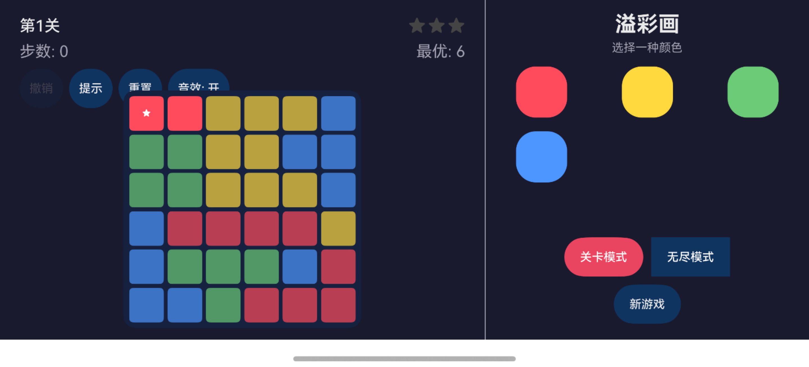
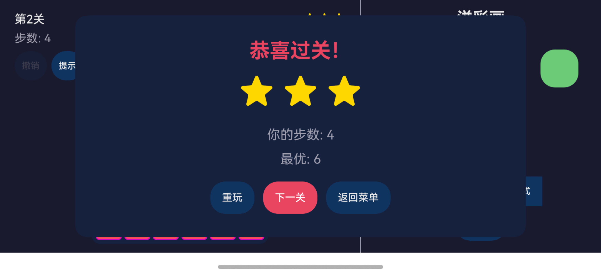
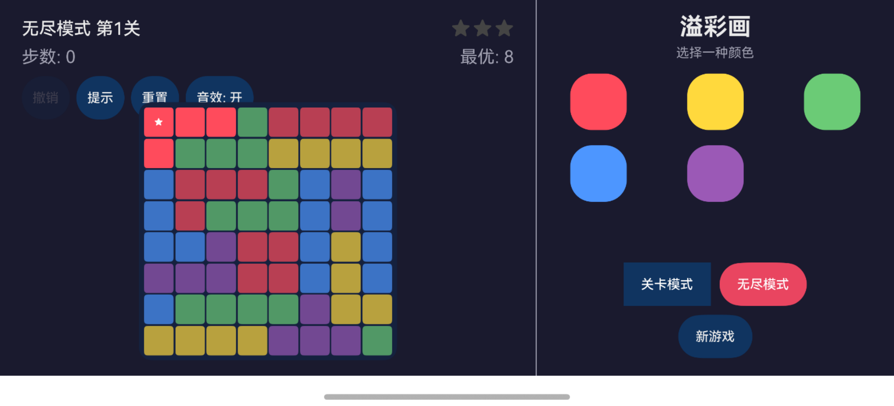

# 溢彩画 (Flood-It)

基于 HarmonyOS ArkUI 框架开发的染色解谜游戏。玩家通过选择颜色、点击棋盘格子，将同色连通区域染为目标颜色，用最少步数将整个棋盘染成同一种颜色。

## 游戏截图

| 游戏主界面 | 胜利弹窗 | 无尽模式 |
|:---:|:---:|:---:|
|  |  |  |

### 试玩演示

<video src="screenshots/device/demo.mp4" controls width="100%"></video>

## 核心玩法

- **选色 → 点格 → 染色**：先在调色板选择目标颜色，再点击棋盘格子，从该格出发 BFS 找出同色连通区并全部染色，伴有涟漪扩散动画
- **关卡模式**：10 个精心设计的关卡，棋盘从 6×6 逐步扩展到 9×9，颜色从 4 种递增到 6 种
- **无尽模式**：随机生成棋盘，挑战最佳步数记录
- **星级评价**：根据步数与最优解的比值评定 1-3 星
- **撤销/重置/提示**：支持撤销操作、重置棋盘、贪心算法提示

## 交互设计

| 操作 | 说明 |
|------|------|
| 点击调色板颜色 | 选中颜色（按钮高亮），再次点击取消 |
| 点击棋盘格子 | 将该格同色连通区染为选中颜色 |
| 撤销 | 回退到上一步状态 |
| 重置 | 回到当前关卡的初始棋盘 |
| 提示 | 高亮显示贪心算法推荐的下一步颜色（2秒后消失） |

## 技术架构

### 项目结构

```
溢彩画/
├── AppScope/                  # 应用全局配置
├── entry/src/main/ets/
│   ├── common/
│   │   └── Constants.ts       # 全局常量（颜色、尺寸、动画参数）
│   ├── models/
│   │   ├── GameEngine.ts      # BFS flood-fill 染色引擎、星级评定
│   │   ├── Solver.ts          # 最优解求解器（组件图 BFS + IDA*）
│   │   ├── BoardGenerator.ts  # 俄罗斯方块几何图案棋盘生成器
│   │   └── LevelData.ts       # 关卡配置（10关）
│   ├── components/
│   │   ├── GameBoard.ets      # 棋盘渲染（CellView @Component）
│   │   ├── ColorPalette.ets   # 调色板（3列 Grid）
│   │   ├── GameHud.ets        # 顶部状态栏 + 控制按钮
│   │   └── VictoryDialog.ets  # 胜利弹窗（星级展示）
│   ├── pages/
│   │   └── GamePage.ets       # 主游戏页面（状态编排、涟漪动画）
│   └── entryability/
│       └── EntryAbility.ets   # 入口 Ability（强制横屏）
└── entry/src/main/resources/  # 字符串、颜色、图标等资源
```

### 核心算法

- **BFS Flood-Fill**：从点击格出发 BFS 搜索同色连通区域，一次性染色
- **涟漪动画**：染色后 BFS 分层，逐层 setTimout 链激活缩放动画（每层 80ms）
- **最优解求解**：将棋盘建模为组件图（component graph），通过 BFS 搜索状态空间；≤9×9 棋盘用 IDA* 精确求解
- **棋盘生成**：80% 概率使用 19 种俄罗斯方块 tetromino 形态贪心平铺 + 严格图着色；20% 概率使用横/竖条纹图案

### 技术栈

- **平台**：HarmonyOS 5.0.5+ / ArkTS
- **开发工具**：DevEco Studio 6.0.2+
- **语言**：ArkTS（HarmonyOS 严格模式 TypeScript）
- **UI 框架**：ArkUI 声明式组件（@Component/@State/@Prop/@Builder）

## 构建与运行

### 环境要求

1. HarmonyOS 系统：HarmonyOS 5.0.5 Release 及以上
2. DevEco Studio：6.0.2 Release 及以上
3. HarmonyOS SDK：6.0.2 Release SDK 及以上

### 运行步骤

1. 使用 DevEco Studio 打开本工程
2. 签名配置（自动签名或手动配置）
3. 连接真机或启动模拟器
4. 点击 Run 运行

### 支持的设备

- 华为手机（横屏模式）

## 许可证

本项目基于 Apache License 2.0 开源。

## 参考

- [yicai.gantrol.com](https://yicai.gantrol.com) — 鸣潮溢彩画解题工具（Web 版）
- [GitHub: gantrol/yicai_wuthering_waves](https://github.com/gantrol/yicai_wuthering_waves)
